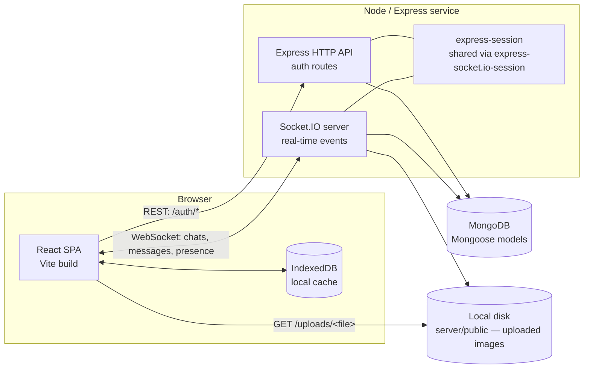
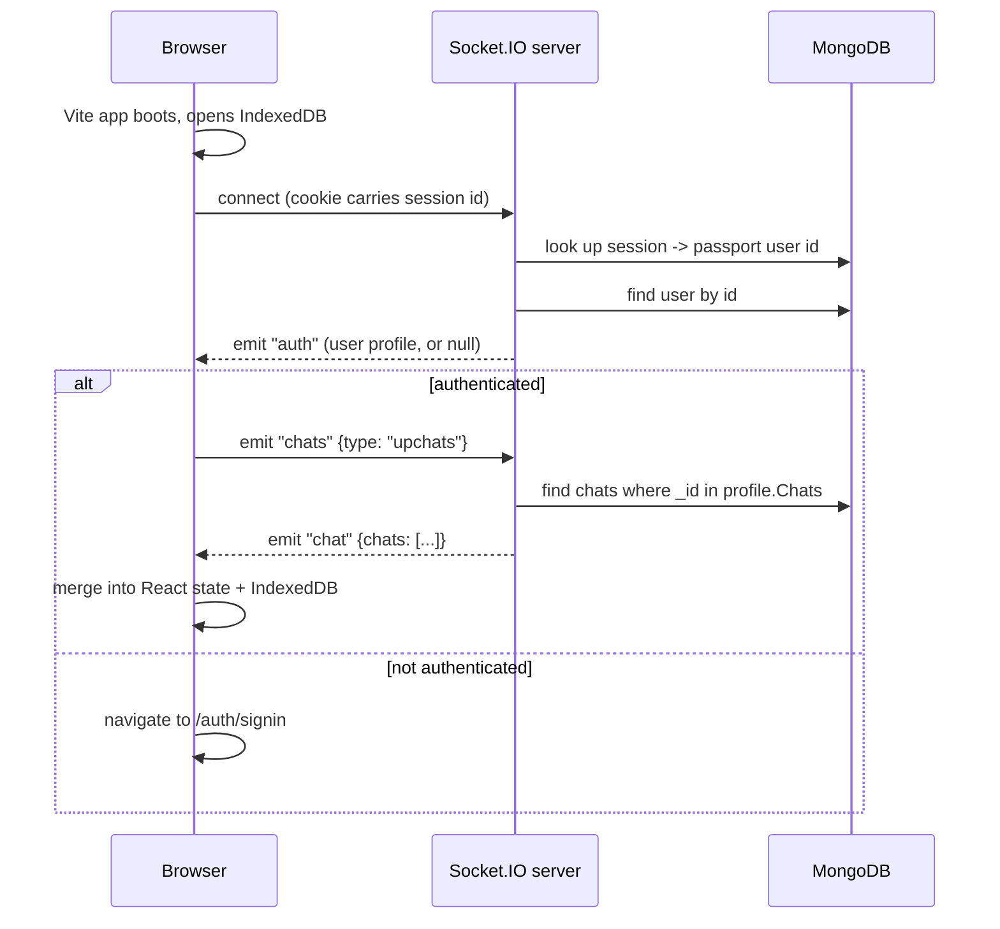

# 2. High-Level Architecture

## The shape of the system

Lavender is two independently deployable services plus a shared database:

That's the whole system. There's no message queue, no cache layer, no microservices —
one Node process owns both the REST auth endpoints and the Socket.IO server, backed
by one MongoDB database. That's a deliberate simplicity choice appropriate to the
current scale, not an oversight — see
[Chapter 11](./11-interview-system-design.md#5-scaling-path-1-instance--many) for
how you'd talk about scaling it past this point.

## Why client and server are separate deployables

Early in this project's life, the client and server lived in one `package.json` at
the repo root, and the server served the built React app as static files
(`express.static`). That's workable for a single deploy target, but it created two
concrete problems:

1. **You couldn't deploy them independently.** A client-only copy change forced a
   full server redeploy, and vice versa.
2. **Socket.IO doesn't work on most "serverless" static hosts.** An earlier attempt
   to deploy this app via a Netlify Function failed for a structural reason, not a
   configuration one: serverless functions are short-lived, stateless invocations,
   and Socket.IO needs a long-lived, stateful TCP/WebSocket connection to a single
   process. You cannot run a WebSocket server as a serverless function — which is
   why the client (deployed to Vercel) and server (deployed somewhere that keeps a
   process alive) have to be separate deployables in the first place.

The fix was to split the repo into `client/` and `server/`, each with its own
`package.json`, `node_modules`, and independent build/start scripts. Now:

- `client/` is a static Vite build — deployed to Vercel (see
  [Chapter 8](./08-deployment.md)), or served by the Node server itself in a
  simpler single-VM deployment.
- `server/` is a long-running Node process — deployable to any host that keeps a
  process alive and reachable on a port (Render, Railway, Fly.io, a plain VM), which
  is a requirement Socket.IO imposes.

See [Chapter 8](./08-deployment.md) for the concrete deployment story.

## Tech stack

| Layer | Choice | Why |
|---|---|---|
| Frontend framework | React 18 + Vite | Fast dev server, standard SPA tooling |
| Client routing | `react-router-dom` v6 | Declarative routes for `/`, `/auth/*`, `/app` |
| Client styling | Tailwind CSS | Utility-first, no separate CSS-file sprawl |
| Client real-time transport | `socket.io-client` | Pairs with the server's Socket.IO |
| Client REST calls | `axios` | Used only for the small `/auth/*` surface |
| Client local persistence | IndexedDB (native browser API) | Offline-first message/profile cache |
| Backend framework | Express 4 | Minimal, well-understood, easy to reason about |
| Real-time transport | Socket.IO 4 | WebSocket with polling fallback, room support |
| Auth | Passport.js (local + custom OTP + Google OAuth2 strategies) | Pluggable strategy model fits three different login flows |
| Session store | `express-session` + `connect-mongo` | Sessions persisted in MongoDB, shared with Socket.IO via `express-socket.io-session` |
| Database / ODM | MongoDB + Mongoose | Document model fits chat/message/user shapes naturally |
| Password hashing | `bcrypt` | Industry standard |
| Input sanitization | `xss` | Strips HTML/script from user-supplied text before it's stored |
| Email delivery | `nodemailer` (Gmail SMTP) | OTP delivery for signup verification |

## Request flow: signing in and loading your chats

To see how the pieces cooperate, here's the sequence for the most common cold-start
path — a user opens the app already logged in:

The key detail: **the socket connection itself is the auth check.** There's no
separate "am I logged in" REST call on load — the server reads the same session
cookie Socket.IO's handshake carries, resolves it to a user via
`express-socket.io-session`, and the first thing it does after a successful
connection is emit `"auth"` with either the user's profile or `null`. The client's
top-level `AppScreen` component listens for that and redirects to `/auth/signin` if
it comes back empty. See [Chapter 4](./04-authentication.md) for the session-sharing
mechanism in detail, and [Chapter 5](./05-realtime-messaging.md) for the full
Socket.IO event catalog.
