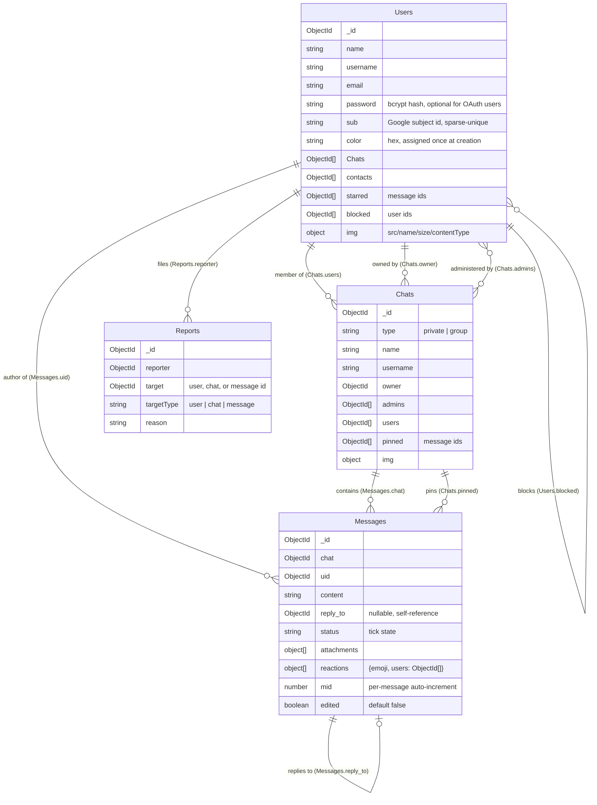

# 3. Data Model

All six collections live in `server/models/`, each a plain Mongoose schema
re-exported from `server/models/exports.js` so the rest of the server imports one
`models` object instead of six separate files.

## Users (`server/models/Users.js`)

The user document doubles as the login credential holder and the public profile —
there's no separate `Profile` collection. Notable fields and why they're shaped
the way they are:

- **`password` is optional**, not required. A user who signs up locally has a
  bcrypt hash here; a user who signs up via Google never sets one — they
  authenticate through the `sub` field instead (Google's stable per-account
  identifier). Making `password` required would break every OAuth signup.
- **`sub` is `unique` + `sparse`.** Sparse means the uniqueness constraint only
  applies to documents where the field is *present* — otherwise every local-signup
  user (who has no `sub`) would collide on `null` after the first one.
- **`color` is assigned once, in a `pre('save')` hook, gated by `this.isNew`.**
  Earlier in this project the hook reassigned a random color on *every* save
  (including profile edits and even unrelated saves like joining a chat), so a
  user's display color would visibly change any time their document was touched.
  Guarding on `isNew` fixed that — color is now a stable per-user identity color,
  the way it needs to be for message-author-color consistency in the UI.
- **`username` is auto-generated if not set** (`user_<id>`), in the same hook, so
  every user always has a stable `@handle` even before they choose one.
- **`Chats` and `contacts` are arrays of `ObjectId`,** not populated references at
  the schema level — they're resolved by explicit queries where needed
  (`Chats: { $in: [...] }`) rather than Mongoose's `.populate()`. This keeps the
  hot-path queries (loading your chat list) predictable and avoids over-fetching.
- **`starred` is an `ObjectId[]` referencing `Messages`,** mirroring `contacts`
  rather than adding a join collection — a user's starred set is small and only
  ever read as "give me my starred messages," so a plain array with a `toggleStar`
  push/pull is simpler than a dedicated `Stars` collection (see the
  `toggleStar`/`getStarred` events in [Chapter 5](./05-realtime-messaging.md#event-catalog)).
- **`blocked` is an `ObjectId[]` referencing `Users`,** the same pattern as
  `starred` — a per-user push/pull list rather than a join collection, since
  it's only ever read as "is this sender in my blocked set." Both
  `SendMessage` and `createChatPrivate` check the *recipient's* `blocked`
  list against the sender before delivering (see the `blockUser` /
  `unblockUser` events in [Chapter 5](./05-realtime-messaging.md#event-catalog)).
- **`mongoose-sequence`** adds an auto-incrementing `user_id` (a small integer,
  separate from `_id`) purely as a legacy numbering field — the app doesn't
  currently use it for anything user-facing.

## Chats (`server/models/Chats.js`)

One schema represents both 1:1 conversations and groups, distinguished by `type`:

- `type: "private"` — exactly two entries in `users`, `owner`/`admins` unused.
  Deleted outright (not just "left") when either participant leaves, since a
  1:1 conversation with one remaining participant isn't meaningful.
- `type: "group"` — `owner` is the creator, `admins` is a superset that always
  includes the owner. Only admins can edit the group (name/photo/bio) or
  promote/demote/remove members; only the owner can promote or demote (see
  `isChatOwner` vs `isChatAdmin` in `server/routes/api/socketEvents.js`).
  Only the owner can delete the group outright (`deleteChat`), which cascades
  to remove the chat's `Messages` and pulls the chat id from every member's
  `Users.Chats`.
- **`pinned` is an `ObjectId[]` referencing `Messages`,** gated the same way
  as group editing — any member can pin/unpin in a private chat, but only an
  admin can in a group (see the `pinMessage`/`unpinMessage` events in
  [Chapter 5](./05-realtime-messaging.md#event-catalog)).

## Messages (`server/models/Messages.js`)

- **`reply_to` is a self-reference** (`ref: 'Messages'`), nullable. This is what
  powers the quoted-reply UI. Resolving it is more subtle than it looks — see the
  callout in [Chapter 5](./05-realtime-messaging.md#the-reply-lookup-bug) about
  why the client can't naively index messages by this field.
- **`attachments` is an embedded array**, not a reference to another collection.
  Each entry is `{ src, name, size, contentType }` — `src` is a generated filename
  on disk, not a URL (the client prefixes it with the API origin at render time).
  See [Chapter 6](./06-file-uploads.md) for the full upload path.
- **`status` is an enum** (`'✔' | '✔✔'`) rather than a boolean or a numeric state
  machine. It's deliberately just "sent" vs "double-checked" today — there's no
  per-recipient read-receipt tracking yet (see the roadmap in
  [Chapter 1](./01-overview.md)).
- **`mid` is a per-message auto-increment** (via `mongoose-sequence`), and it's
  important not to confuse it with `_id`: the client's local message cache is keyed
  by `mid` (see [Chapter 5](./05-realtime-messaging.md)), while relationships like
  `reply_to` reference the Mongo `_id`. They are different key spaces that happen
  to both exist on the same document.
- **`edited` is a plain boolean, not an edit history.** Editing overwrites
  `content` in place and flips this flag; the previous content isn't retained
  anywhere. That's enough to render an "(edited)" label but not enough to show
  an edit history — see the `editMessage` event in
  [Chapter 5](./05-realtime-messaging.md#event-catalog).
- **`reactions` is an embedded array of `{ emoji, users: ObjectId[] }`,** one
  entry per distinct emoji used on the message, not one entry per reaction. A
  react/unreact toggle (`reactMessage`) pushes or pulls the reacting user's id
  from the matching emoji's `users` array (creating the entry if it's the
  first use of that emoji, and dropping it once its `users` array empties) —
  structurally the same toggle pattern as `promoteUser`/`demoteUser`, applied
  to an embedded array instead of a top-level field.

## Reports (`server/models/Reports.js`)

A flat log of user-submitted reports, not tied into any moderation workflow
yet — there's no admin UI reading this collection today. `target` is an
untyped `ObjectId` (not a `ref`) because `targetType` determines which
collection it points into (`user`, `chat`, or `message`); a single polymorphic
`ref` isn't expressible in Mongoose without a discriminator, and a three-field
log didn't justify one. `reason` is free text, sanitized with the same `xss`
call used on message content.

## Permissions / Settings (`server/models/Permissions.js`, `Settings.js`)

Both are currently minimal placeholder schemas (`{ permission: Object }` /
`{ permission: Object }` with an auto-increment id) — present in the data model but
not yet wired into any route or socket handler. They're the intended home for
fine-grained group permissions (a "Permissions" tab already exists in the group-info
UI as a "coming soon" placeholder pointing at this future work).
