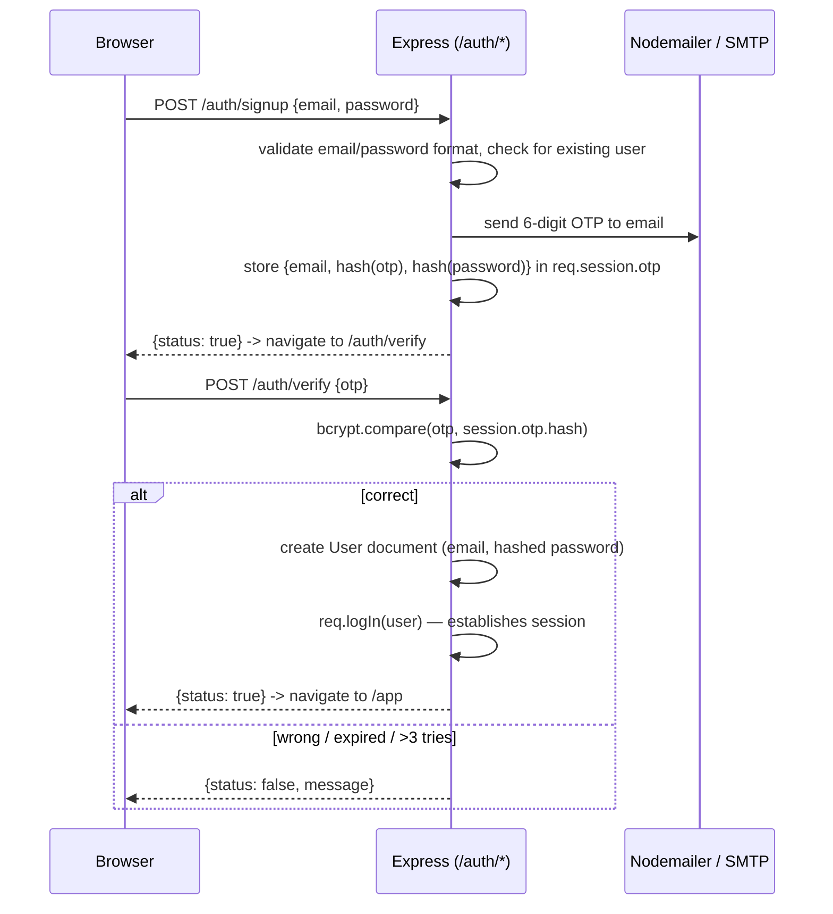
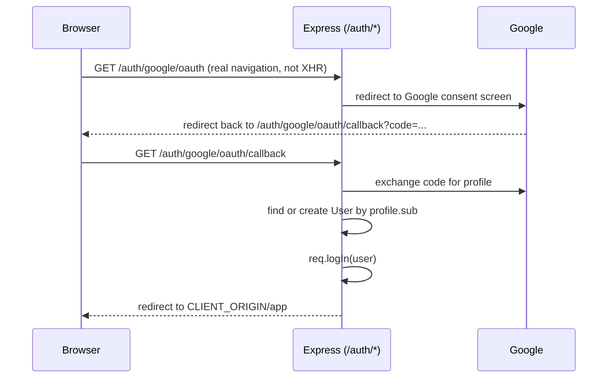

# 4. Authentication & Sessions

Lavender supports three ways to establish a session: local signup + email OTP,
local signin, and Google OAuth. All three converge on the same thing — a
Passport-authenticated Express session — which is what makes the Socket.IO
connection able to identify the user later.

## Passport strategies (`server/routes/auth/passportSetup.js`)

Three strategies are registered:

```js
passport.use('local-signin', new LocalStrategy({ usernameField: 'email', passwordField: 'password' }, signInCallback));
passport.use('local-signup', new LocalStrategy({ usernameField: 'email', passwordField: 'password', passReqToCallback: true }, signUpCallback));
passport.use('local-otp', new CustomStrategy(ValidateOtp));
passport.use('google', new GoogleStrategy(credentials, GoogleCallback));
```

`local-otp` uses `passport-custom`, not `passport-local` — it doesn't verify a
username/password pair, it verifies whatever's in `req.session.otp` against the
code the user submitted. That's a deliberate use of Passport slightly outside its
usual "credential verification" role: it's really using Passport's `done(err, user,
info)` contract as a convenient way to plug OTP verification into the same
`req.logIn()` pipeline every other strategy uses, so a successful OTP check
establishes a real logged-in session exactly like signing in would.

## Signup flow



The account is only created **after** OTP verification succeeds — signup doesn't
write a `Users` document up front. Until then, the pending signup lives entirely in
`req.session.otp` (email, bcrypt hash of the OTP, bcrypt hash of the chosen
password, a `tries` counter, and a timestamp used for the 3-minute client-side
countdown). This means an abandoned signup never leaves a half-created account
behind.

## Google OAuth flow



Two details worth calling out because they're easy to get wrong (and were, earlier
in this project's history):

1. **Passport's `passReqToCallback` changes the verify-callback's parameter list.**
   With it on, the callback receives `(req, accessToken, refreshToken, profile,
   done)` — five arguments, not four. Lavender doesn't need `req` in the Google
   callback, so it simply leaves `passReqToCallback` off and keeps the callback
   signature as `(accessToken, refreshToken, profile, done)`. Turning that option on
   without updating the callback's parameter list silently shifts every parameter
   over by one — `done` ends up bound to `profile`, and calling it does nothing
   useful. This is the kind of bug that fails silently (no error, the login button
   just never finishes) rather than loudly.
2. **The OAuth kick-off has to be a real page navigation, not an AJAX call.** A
   browser will only follow a 3xx redirect to Google's own login domain (and later
   trust cookies Google sets) if the request was a top-level navigation — `GET
   /auth/google/oauth` is triggered from an `<a href>`, not from `axios`.

## Session and Socket.IO sharing

This is the piece that makes real-time auth work without a second login step. The
same `express-session` middleware instance is handed to both Express and
Socket.IO:

```js
// server/app.js
const sessionMiddleware = session({ store: mongoStore.create({...}), ... });
app.use(sessionMiddleware);           // HTTP requests get req.session
io.use(sharedsession(sessionMiddleware, { autoSave: true }));  // socket handshakes get socket.handshake.session
```

`express-socket.io-session` is the bridge: it reads the same session cookie during
the Socket.IO handshake and populates `socket.handshake.session` with the same data
`req.session` would have. Because sessions are persisted in MongoDB (via
`connect-mongo`), this works even across a server restart — the browser's cookie
still resolves to a real session document.

Concretely, when a socket connects, `onConnection` in
`server/routes/api/socketEvents.js` does:

```js
const pid = socket.handshake.session.passport.user._id;
profile = await models.UsersModel.findById(pid);
```

`passport.user` on the session is what `passport.serializeUser` put there when the
user logged in via any of the three strategies above — Passport's session
integration works identically whether the request came in over HTTP or was read
from a Socket.IO handshake, because it's the same session store underneath.

## Security notes

- **Passwords** are bcrypt-hashed (cost factor 10) before storage, both for local
  signup and inside the OTP-pending session blob (so even the *pending* password
  never sits in plaintext in the session store).
- **User-supplied text** (message content, chat/group names, profile fields) is run
  through the `xss` package before being persisted, stripping executable HTML.
- **CSRF**: the project deliberately does *not* implement token-based CSRF
  protection. The mitigations in place instead are a strict CORS allow-list
  (`CLIENT_ORIGIN` only, with `credentials: true`) and `sameSite` cookies (`lax` in
  development, `none`+`secure` in production, which still requires the browser to
  have sent the request from a page that could obtain the session cookie in the
  first place). A `csurf`-based token flow existed in an earlier version of this
  project and was removed because the server never actually issued a real token —
  it's flagged here as a legitimate next step if this app's threat model changes
  (e.g. once it supports state-changing GET-adjacent flows or third-party embeds).
