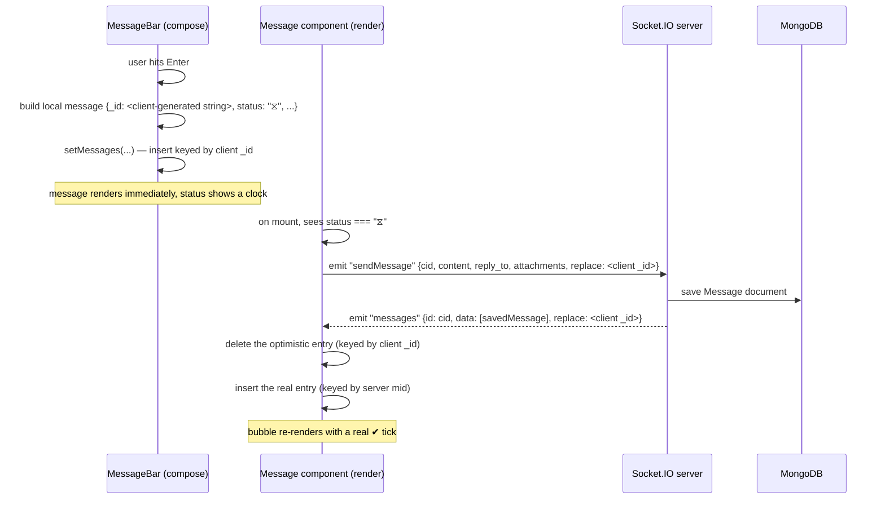

# 5. Real-Time Messaging

This is the core of the app, and the subsystem most worth understanding deeply if
you're studying this project for an interview — it's where "optimistic UI",
"eventual consistency with a source of truth", and "client-side caching" all show
up in a concrete, small-enough-to-hold-in-your-head form.

## The socket connection is per-user, not per-chat

A client opens exactly one Socket.IO connection for the whole session
(`client/src/components/MainScreen/AppScreen.jsx`), authenticated implicitly via
the shared session (see [Chapter 4](./04-authentication.md)). On connect, the
server joins that socket to a Socket.IO **room** per chat the user belongs to:

```js
// server/routes/api/socketEvents.js
const chatSet = new Set(profile.Chats.map((chat) => chat.toString()));
chatSet.forEach((id) => socket.join(id));
```

Broadcasting a new message is then just `io.to(chatId).emit(...)` — Socket.IO
delivers it to every socket that's joined that room, i.e. every member of that
chat who's currently connected. `chatSet` is also used as a fast in-memory
membership check (e.g. "is this socket allowed to post into this chat?") without a
database round-trip on every message.

## Event catalog

| Direction | Event | Payload | Purpose |
|---|---|---|---|
| C→S | `chats` | `{type}` | Fetch the user's chat list |
| S→C | `chat` | `{type, chats}` | Chat list / single chat upsert (also used after create/update/join/promote/demote/remove/pin/unpin) |
| C→S | `messages` | `{cid, mid}` | Fetch recent history for a chat |
| S→C | `messages` | `{id, data, replace?}` | New message(s) for a chat; `replace` swaps out an optimistic placeholder |
| C→S | `sendMessage` | `{cid, content, reply_to?, attachments?, replace?}` | Send into an existing chat |
| C→S | `createChatPrivate` | `{cid: otherUserId, content?, ...}` | Find-or-create a 1:1 chat, optionally sending the first message in the same round trip |
| C→S | `createChat` | `{name, members, file?, ...}` | Create a group |
| C→S | `updateChat` / `updateProfile` | field diffs | Edit group / own profile |
| C→S | `join` | `[chatId]` | Join a group you're not yet a member of |
| C→S | `leaveChat` | `{id, del}` | Leave a chat (deletes it outright if private) |
| C→S | `deleteMessage` | `[mid, id, cid]` | Delete a message you can see |
| S→C | `deleteMessage` | `[id, mid, chatId]` | Broadcast a deletion |
| C→S | `editMessage` | `{id, cid, content}` | Edit a message you authored; server rejects edits to someone else's message |
| S→C | `editMessage` | `{id, mid, cid, content, edited}` | Broadcast the edited content to the chat room |
| C→S | `toggleStar` | `{id}` | Star or unstar a message (push/pull on `Users.starred`) |
| C→S | `getStarred` | — | Fetch your full starred-message list |
| S→C | `starred` | `string[]` | Your current starred message ids (sent after `toggleStar`/`getStarred`) |
| S→C | `starredMessages` | `Message[]` | Your starred messages, populated (sent after `getStarred`) |
| C→S | `promoteUser` / `demoteUser` / `removeUser` | `{chatID, userID}` | Group role management (owner/admin only — see [Chapter 3](./03-data-model.md)) |
| C→S | `deleteChat` | `{id}` | Delete a group outright (owner only) — cascades to the chat's `Messages` |
| S→C | `leaveChat` | `[id, del]` | Broadcast that a chat was left or deleted, to every member's room |
| C→S | `typing` | `{cid}` | Broadcast that you're typing in a chat (no persistence) |
| S→C | `typing` | `{cid, uid}` | Someone else is typing; client auto-clears the indicator after a few seconds of silence |
| C→S | `blockUser` / `unblockUser` | `{id}` | Block/unblock a user (push/pull on `Users.blocked`) |
| S→C | `blocked` | `string[]` | Your current blocked-user ids (sent after `blockUser`/`unblockUser`, and once on `auth`) |
| C→S | `report` | `{id, targetType, reason?}` | File a report against a user, chat, or message (`targetType` one of `user`/`chat`/`message`) |
| C→S | `pinMessage` / `unpinMessage` | `{id, cid}` | Pin/unpin a message (any member in a private chat, admin-only in a group) |
| C→S | `reactMessage` | `{id, cid, emoji}` | Toggle your reaction with a given emoji on a message |
| S→C | `reactMessage` | `{id, mid, cid, reactions}` | Broadcast the message's updated `reactions` array to the chat room |
| C→S | `search` | `{query, target}` | Search users / messages / chats |
| S→C | `searchResults` | `{results, target}` | — |
| C→S | `contacts` / `getProfile` | — / `{uid}` | Fetch your contact list / someone's profile |
| S→C | `auth` | `user \| null` | Emitted once on connect — this *is* the "am I logged in" check |
| S→C | `profile` | user or diff | Your own profile (full doc) or a broadcast diff to your chat rooms after an edit |

## The send pipeline: optimistic UI, then reconciliation

Sending a message doesn't wait for the server before showing it. The flow, end to
end:



**Message forward reuses this same `sendMessage` event rather than adding a
dedicated one** — `ForwardDialog.jsx` emits `sendMessage` with the original
content against the chosen destination chat's id. It skips the optimistic-insert
half of the pipeline described below (there's no local pending-message bubble in
a chat that isn't currently open), so a forwarded message simply appears once the
server round trip completes.

The interesting part is *where* the actual `socket.emit("sendMessage", ...)` call
lives: it's not in the compose box's submit handler. It's in a `useEffect` inside
the individual **message row** component
(`client/src/components/MainScreen/MessageDialog/MessageBar/Message.jsx`), gated on
`messageItem.status === "⧖"`. The compose box's only job is to insert a
pending-status message into local state; the message row, on its first mount,
notices its own pending status and fires the network call. This decouples "add an
optimistic message to the UI" from "get it to the server" — which matters because
the exact same code path handles a message that's still pending because the app was
offline when it was first drafted (it'll retry the emit next time that row mounts),
not just the split-second between hitting Enter and the round trip completing.

### Two different key spaces, and a bug that came from confusing them

The client's message cache (`Messages[chatId]`, held in `AppScreen`'s React state
and mirrored into IndexedDB) is keyed by `mid` — the small auto-incrementing
integer from [Chapter 3](./03-data-model.md) — for every message that's been
confirmed by the server. But **the optimistic placeholder is keyed by its
client-generated `_id`** (a timestamp string), because it doesn't have a `mid` yet.
The `replace` field in the `sendMessage` payload and the `messages` broadcast is
what lets the client delete the placeholder (by its client `_id`) at the same time
it inserts the confirmed message (by its server `mid`) — two different keys for the
same conceptual message, deliberately, because at the moment the placeholder is
created the server hasn't assigned the real key yet.

#### The reply lookup bug

This dual-key-space design caused a real bug worth understanding, because it's a
good example of "the data was always correct, only the client's *index* into it was
wrong." A message's `reply_to` field stores the Mongo `_id` of the message it's
replying to (see [Chapter 3](./03-data-model.md)) — but the client's message cache
is indexed by `mid`, not `_id`. Looking up `Messages[chatId][someMessage.reply_to]`
therefore *always* misses, because you're using an `_id` to index a map keyed by
`mid`. The reply relationship was correctly persisted server-side the whole time;
the client just couldn't find the quoted message to render its preview.

The fix (`client/src/components/MainScreen/MessageDialog/Messages.jsx`) builds a
second, `_id`-indexed lookup map once per render of the message list —
`messagesById`, built from the same `mid`-keyed source — and passes each message's
resolved `reply_to` target down as a prop, instead of asking each message row to
re-derive it from the wrong index. The lesson generalizes: when a collection is
keyed one way for one purpose (fast ordered iteration by `mid`) but referenced
another way for a different purpose (relational lookup by `_id`), you need an
explicit second index — you can't paper over it by reusing the first one.

## Client-side caching: IndexedDB as an offline-first store

Every message, chat, and profile the client has ever seen is mirrored into
IndexedDB (`client/src/components/MainScreen/AppScreen.jsx`), in three object
stores: `meta` (your own session/profile), `chats`, `messages`, `profiles`. On
launch, the app reads its last-known state from IndexedDB **before** the socket
even finishes connecting, so a returning user sees their chat list and recent
messages instantly, with the live socket connection reconciling on top of that
(new messages arrive, deletions propagate, profile edits update in place). This is
the same pattern React Query / SWR give you for REST APIs, implemented by hand for
a WebSocket-driven data source.
