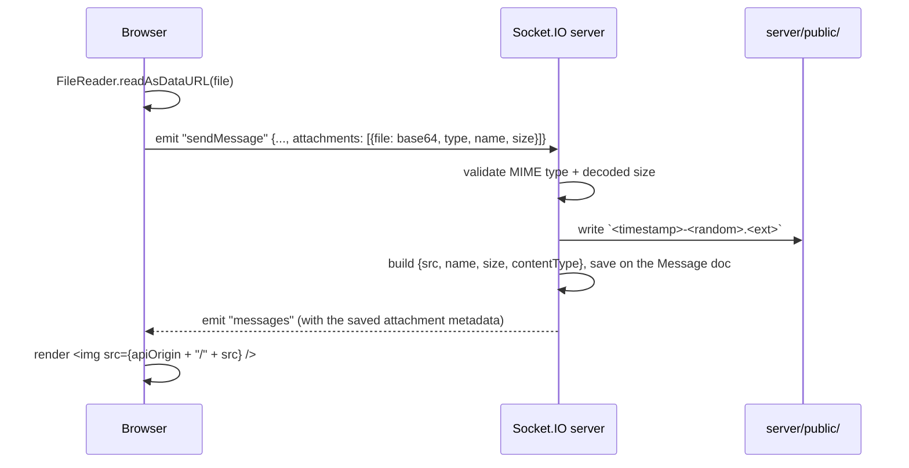

# 6. File & Image Uploads

There are three things in Lavender that involve a file: a user's avatar, a group's
photo, and a message's attachments. All three go through the **same mechanism**,
which is worth understanding on its own because it's an unusual choice compared to
the "typical" multipart-form-upload-to-an-endpoint pattern.

Avatars and group photos are always images. Message attachments accept a wider
allow-list — images plus common document types (PDF, Word/Excel/PowerPoint, plain
text, CSV, zip) — so a chat can carry a shared document, not just pictures.

## The mechanism: base64 over the existing Socket.IO connection

There is no `POST /upload` REST endpoint and no `multer` middleware (an earlier
version of the server imported `multer` but never wired it to a route — it's since
been removed as dead weight). Instead:

1. The browser reads the selected file with `FileReader.readAsDataURL()`, which
   produces a `data:<mime>;base64,<data>` string.
2. The client strips the `data:...;base64,` prefix and sends the raw base64 payload
   as a field inside a normal Socket.IO event — e.g. `sendMessage`'s `attachments`
   array, or `updateProfile`'s `file` field.
3. The server decodes it with `Buffer.from(base64, 'base64')`, validates the MIME
   type against an allow-list, checks the decoded size against a 2 MB cap, and
   writes it to `server/public/` with a generated filename.
4. The saved metadata — `{ src, name, size, contentType }`, where `src` is just the
   generated filename — is what actually gets persisted on the `Users`, `Chats`, or
   `Messages` document (see [Chapter 3](./03-data-model.md)).
5. `server/public/` is served as static files by Express (`app.use(express.static(...))`
   in `server/app.js`). The client resolves `src` against the API origin at render
   time — an image attachment renders as ``;
   a non-image attachment (`contentType` outside the image allow-list) renders as a
   file card instead, and clicking it fetches the resolved URL as a blob and saves
   it locally (`client/src/download.js`) rather than navigating to it — the client is
   responsible for prefixing the API origin either way, because `src` on the
   document is just a bare filename, not a URL.

## Allow-lists

`server/routes/api/socketEvents.js` keeps two separate MIME allow-lists:

- `allowedTypes` — images only (`png`, `jpeg`, `webp`, `svg`). Used for every
  upload site by default, including avatars and group photos.
- `allowedDocTypes` — common document formats (`pdf`, `doc`/`docx`, `xls`/`xlsx`,
  `ppt`/`pptx`, `txt`, `csv`, `zip`). Passed as an extra allow-list *only* on the
  `sendMessage` attachment path, so a profile or group photo upload can never
  smuggle in a non-image file even if a malicious client bypasses the file
  picker's `accept` attribute — the server enforces the same restriction
  regardless of what the client claims.

The validation and disk-write logic is centralized in one helper,
`saveUpload()` in `server/routes/api/socketEvents.js`, used by all three upload
sites (profile photo, group photo, message attachments) so the size cap and the
base image allow-list can't drift between them — `saveUpload()` takes an optional
extra allow-list argument, which only the message-attachment call site passes (see
[Allow-lists](#allow-lists) below).

## Why this design, and its tradeoffs

Sending files as base64 inside a JSON-ish socket payload is **not** the conventional
choice — most apps use a multipart `POST` to a dedicated upload endpoint (which is
what `multer` is built for). The base64-over-socket approach was kept because it
fits this app's architecture with minimal moving parts: no separate HTTP route to
authenticate and rate-limit, no separate client code path for "the REST way" versus
"the socket way," and the existing session-authenticated socket connection is
already the trusted channel for everything else the app does.

The real costs, worth naming explicitly if you're discussing this in an interview:

- **~33% size overhead.** Base64 encodes 3 bytes as 4 characters, so a 2 MB image
  is roughly 2.7 MB over the wire — meaningfully worse than a raw multipart upload,
  especially at scale or on slow connections.
- **No streaming.** The whole file has to be read into memory (both a JS string on
  the client and a `Buffer` on the server) before anything happens with it, whereas
  a multipart upload can be streamed to disk in chunks. This is the main reason the
  size cap is a hard 2 MB rather than something more generous — this design doesn't
  scale gracefully to large files or video.
- **The Socket.IO event carrying a multi-megabyte payload competes with every other
  real-time event** on the same connection for bandwidth and the server's event-loop
  attention, whereas a dedicated upload endpoint is naturally isolated from
  message-delivery latency.

If this app needed to support larger files, many concurrent uploads, or resumable
uploads, the honest next step is a real upload endpoint (multipart or presigned
direct-to-object-storage) and using the socket connection only to notify recipients
once the upload has completed — decoupling "get the bytes somewhere durable" from
"tell people about it in real time." That's a good example of a scaling question an
interviewer might ask about this project, and this file-upload subsystem is the
right place to point to as the answer.

## Storage is local disk, not object storage

`server/public/` is a directory on the same machine the Node process runs on. That's
fine for a single-instance deployment but doesn't survive a redeploy on most PaaS
hosts (ephemeral filesystems) and doesn't work at all if you ever run more than one
server instance behind a load balancer (an upload saved to instance A's disk is
invisible to instance B). The natural production fix is swapping `saveUpload()`'s
`fs.promises.writeFile` for an S3-compatible object store client and storing the
resulting URL instead of a bare filename — the rest of the pipeline (validation,
the metadata shape saved on documents, the client's rendering code) doesn't need to
change, because `src` is already treated as an opaque reference the client
resolves against a base URL.
