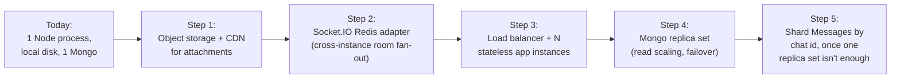

# 11. Interview Prep: System Design Deep Dive

Part of the [Interview Prep section](./09-interview-prep.md). A "design a chat
app" prompt is one of the most common system-design interview questions there is
— which is useful, because it means you can walk in with a *built, working*
answer instead of a whiteboard sketch. This chapter trains that specifically: it
re-derives Lavender's design from requirements the way an interview expects you
to, with real capacity numbers pulled from this codebase's actual schema and
code, then ends with a concrete design review of gaps that are still open.

## 1. Requirements, the way an interviewer expects to hear them back

A system-design round almost always starts by asking you to state requirements
before designing anything. Here's how Lavender's actual feature set (see
[Chapter 1](./01-overview.md#feature-status)) maps onto that framing:

**Functional requirements:**
- 1:1 and group messaging, with reply-to, edit, forward, and delete.
- Media/document attachments up to a fixed size cap.
- Presence-adjacent signals: typing indicators, delivery ticks.
- Account system: email+OTP and OAuth login, block/report.

**Non-functional requirements, and where Lavender lands on each:**

| Requirement | Lavender's actual answer |
|---|---|
| Low-latency delivery | Yes, within a single process — WebSocket push, no polling. |
| Durability (messages survive a crash) | Yes — every message is written to MongoDB *before* being broadcast, not just held in memory. |
| Consistency model | See [§4](#4-delivery-guarantees-and-consistency-be-precise-here) — this is the part interviewers probe hardest and where being precise matters most. |
| Availability / horizontal scale | **Not yet** — single process, see [§5](#5-scaling-path-1-instance--many). This is a deliberate, named scope limit, not an oversight. |
| Multi-device sync | **Not implemented** — one session per login, no explicit multi-device fan-out logic beyond "every socket for that session gets everything its rooms receive." |

Stating the non-functional requirements *and* being honest about which ones the
current design doesn't meet is itself a big part of what's being evaluated —
see the note on honesty in [Chapter 9](./09-interview-prep.md#a-note-on-honesty).

## 2. Capacity estimation, with real numbers

Interviewers want to see you convert requirements into rough numbers before
picking components. These are Lavender-specific, derived from the actual schema
in [Chapter 3](./03-data-model.md), not generic placeholders.

**Message size.** A `Messages` document is `chat` + `uid` (2 ObjectIds, 24 bytes
each), `content` (say 100 bytes average for a text message), `status`, `mid`,
`edited`, timestamps, plus empty `attachments`/`reactions` arrays most of the
time. That's roughly **250–400 bytes per text message** as stored in MongoDB —
call it 350 bytes for round numbers. An attachment message adds the
`{src, name, size, contentType}` metadata (another ~150 bytes) but the file
itself lives on disk, not in the document — see
[Chapter 6](./06-file-uploads.md).

**Worked example at a hypothetical 100K DAU:**

| Assumption | Value |
|---|---| 
| Daily active users | 100,000 |
| Avg. messages sent per user per day | 40 |
| Total messages/day | 4,000,000 |
| Average messages/sec | ~46 |
| Peak messages/sec (5× average, typical for chat) | ~230 |
| Storage growth/day (text only, 350 B/msg) | ~1.4 GB/day → ~500 GB/year |
| % of messages with an attachment (est.) | ~15% |
| Attachment storage/day (600K files × avg 300 KB) | ~180 GB/day |

The split matters: **document storage growth is small and boring; attachment
storage growth is the real capacity problem**, and it grows on local disk today
(see [Chapter 6](./06-file-uploads.md#storage-is-local-disk-not-object-storage))
— which is exactly why "move uploads to object storage" is the first item in the
scaling path below, not an afterthought.

**Connection count.** Every open tab holds one persistent Socket.IO connection.
At 100K DAU with, say, 20% concurrently online, that's ~20,000 concurrent
WebSocket connections — comfortably within what a single well-tuned Node process
can hold *from a connection-count perspective* (Node/`ws` can hold far more than
that on one box); the real single-instance ceiling here isn't connection count,
it's the per-process room-broadcast problem in [§5](#5-scaling-path-1-instance--many).

**The exercise, not the exact numbers, is what's being scored.** An interviewer
rarely cares whether you say 40 or 60 messages/user/day — they care that you (a)
produce a number instead of skipping straight to architecture, and (b) use that
number to justify a design decision downstream (e.g. "attachment storage
dominates, so object storage + CDN is priority one, not a horizontally-scaled
message-fanout layer").

## 3. Component breakdown

Reusing the architecture from [Chapter 2](./02-architecture.md), but framed the
way a system-design answer structures it — as replaceable components with a
stated responsibility each, not just "the code that exists":

| Component | Responsibility | Lavender's implementation today |
|---|---|---|
| Edge / connection layer | Hold persistent client connections, authenticate them | Socket.IO server, authenticated via the shared Express session ([Ch. 4](./04-authentication.md#session-and-socketio-sharing)) |
| Fan-out layer | Route a message to every recipient currently connected | Socket.IO rooms, one room per chat ([Ch. 5](./05-realtime-messaging.md)) |
| Durable storage | Persist messages, users, chats | MongoDB, one database, no sharding |
| Session store | Resolve a cookie to an identity, shared across HTTP and WS | MongoDB via `connect-mongo` — already instance-agnostic |
| Object/blob storage | Store attachment bytes | Local disk (`server/public/`) — the one component *not* yet instance-agnostic |
| Auth | Establish identity | Passport (local+OTP, Google OAuth) — [Ch. 4](./04-authentication.md) |

The useful interview skill here is naming *which* of these six components is the
scaling bottleneck and why (fan-out layer and object storage — both process-
or disk-local today) rather than treating "scale it" as one undifferentiated
problem.

## 4. Delivery guarantees and consistency — be precise here

This is the question that separates a memorized answer from an understood one.
Lavender's actual guarantee, stated precisely:

- **A message is durable before it's broadcast.** The server calls
  `MessagesModel.create(...)` (or equivalent) and only emits to the room after
  the write resolves — so "the message was shown to the sender optimistically"
  and "the message is safely in the database" are not the same event, and the
  code is ordered so the DB write happens first. See the send pipeline in
  [Chapter 5](./05-realtime-messaging.md#the-send-pipeline-optimistic-ui-then-reconciliation).
- **Delivery to *currently connected* recipients is at-most-once per socket, not
  exactly-once system-wide.** If a recipient's socket is connected, they get one
  `io.to(room).emit(...)`. If they're offline, there's no queued redelivery event
  — they get the message the next time they load that chat's history (a
  `MessagesModel.find`/aggregate, not a replay of missed socket events). That's
  actually a reasonable design — **history-on-reconnect is a simpler and more
  robust substitute for a message queue at this scale**, because it doesn't need
  per-recipient offset tracking — but it's worth being able to say precisely
  rather than claiming a stronger guarantee ("exactly-once delivery") that isn't
  actually implemented.
- **There is no server-side ack from the client back to "I received this."** The
  double-check `✔✔` in the schema is defined but not driven by any real
  per-recipient signal today (see [Chapter 10](./10-interview-qna.md#how-would-you-add-read-receipts--delivery-status-per-recipient)
  for how you'd add one) — so today's "delivered" state really means "the server
  successfully broadcast it," not "a specific recipient's client confirmed
  receipt."

If asked "is this exactly-once delivery," the correct answer is **no — it's
at-most-once live delivery, backstopped by durable storage and a pull-based
history fetch on reconnect**, and that's a deliberate, reasonable tradeoff for a
chat app at this scale, not a gap.

## 5. Scaling path: 1 instance → many

Concretely, in the order you'd actually do it (matches the priority order in
[Chapter 10](./10-interview-qna.md#this-works-with-one-server-instance-how-would-you-scale-it-horizontally)):



- **Step 1 first, not last** — because the capacity math in §2 shows attachment
  storage is the fastest-growing resource, and because it's also required before
  step 3 is safe at all (multiple instances writing to one box's local disk is
  already broken, independent of the Socket.IO room problem).
- **Step 2 before step 3** — a load balancer distributing connections across
  instances is actively harmful without it: two users in the same chat connected
  to *different* instances would stop seeing each other's messages, since
  `io.to(room).emit()` only reaches sockets on the process that issued it. The
  Redis (or equivalent pub/sub) adapter is what makes an emit on instance A reach
  a socket connected to instance B.
- **Sessions need no work at step 3** — already MongoDB-backed via
  `connect-mongo`, so any instance can authenticate any session cookie. Worth
  saying explicitly in an interview: not every piece of state needs the same fix,
  and correctly identifying *which* state is already externalized (sessions) vs.
  still process-local (rooms) is the actual skill being tested.
- **Step 5 is deliberately last and conditional** — sharding is the highest-cost,
  highest-complexity step on this list (it changes how every query into
  `Messages` has to be written), and a single well-provisioned MongoDB replica set
  handles a lot of write volume before it's actually necessary. Reaching for it
  before steps 1–4 are exhausted is a common system-design interview
  overcorrection — naming *why* you'd defer it is worth more than naming it.

## 6. A concrete design review: what I'd flag in this codebase today

A strong closing move in a system-design interview, if there's time, is
reviewing your own design for gaps rather than waiting to be asked. Lavender has
one excellent, real example to walk through — the chat-history fetch discussed in
full in [Chapter 10](./10-interview-qna.md#the-chat-history-fetch-doesnt-sort-the-results-or-check-that-im-a-member-of-the-group-is-that-actually-true-and-what-would-you-do-about-it):

```js
const obj = { chat: new ObjectID(stream.cid) };
if (!chatSet.has(stream.cid)) obj.type = 'group';
const data = await models.MessagesModel.aggregate([
  { $match: obj },
  { $limit: 30 },
  // ...lookup/unwind for reply_to
]);
```

Walking through it as a design review, in the order you'd actually catch these:

1. **Correctness: no `$sort` before `$limit`.** Fix: add
   `{ $sort: { createdAt: -1 } }` before the `$limit` stage.
2. **Performance: no index backs `{ chat, type }` or `createdAt`.** The only
   indexes on `Messages` are a text index on `content` and the auto-increment
   index on `mid` (see [Chapter 3](./03-data-model.md)). Fix: a compound index
   `{ chat: 1, createdAt: -1 }`, which serves the match, the sort, *and* makes
   cursor-based pagination (see #4) efficient.
3. **Security: no authorization check.** `chatSet.has(stream.cid)` gates a
   query *filter*, not access — a request for a `cid` the connected user isn't a
   member of still runs, just constrained to `type: 'group'`. Fix: `if
   (!chatSet.has(stream.cid)) return;` before the query — a single early return,
   since membership is already resolved in memory at connection time.
4. **Missing feature: pagination.** The handler hard-codes `$limit: 30` with a
   commented-out cursor (`stream.mid ? { $gt: stream.mid } : { $lt: stream.mid }`)
   that's never wired up — so a chat with more than 30 messages has no way to
   load older history at all today. Fix: accept a `before` cursor from the client
   (the oldest currently-loaded message's `createdAt` or `mid`), add it to `obj`
   as a `$lt` condition, and the same compound index from #2 makes this cheap.

Presenting a finding this way — correctness, then performance, then security,
then missing functionality, each with a one-line concrete fix — is a good general
template for a design-review portion of any system-design interview, independent
of this specific bug.
