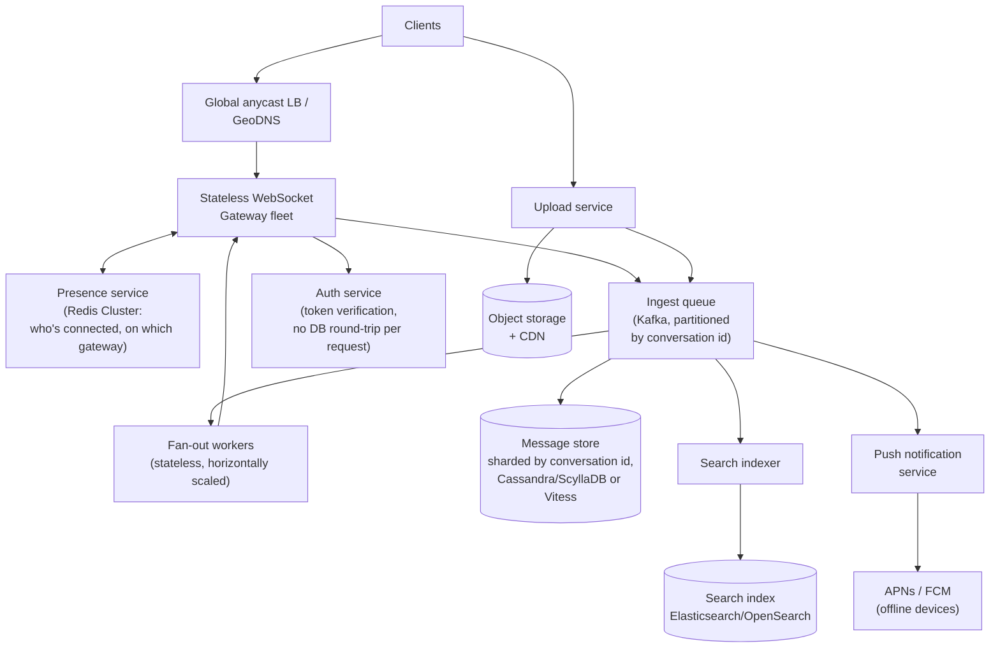

# 14. Interview Prep: An Ideal, Web-Scale Design

Part of the [Interview Prep section](./09-interview-prep.md). [Chapter 11](./11-interview-system-design.md)
answered *"scale Lavender, as it exists, past one instance"* — an incremental path
from a real, running system. This chapter answers a different, equally common
prompt: **"forget the existing code — if you were building this for WhatsApp/
Discord-scale usage from day one, what would the architecture look like?"** That's
a greenfield question, and interviewers ask it specifically to see whether you can
design past the constraints of whatever's in front of you, not just patch what
exists.

**Read this chapter as a thought exercise, not a criticism of Lavender.** Every
architecture below is deliberately over-built for a project at Lavender's actual
scale (see the honesty note in [Chapter 9](./09-interview-prep.md#a-note-on-honesty))
— the point isn't "this is what Lavender should have been," it's "this is the
answer when an interviewer removes the constraint that you have to reuse existing
code." [§8](#8-mapping-lavender-onto-this-picking-the-right-amount-of-architecture)
comes back to why over-building this for a real project would itself be a mistake.

## 1. Target scale for this exercise

Pick a concrete target before designing anything — "web scale" without numbers
isn't a requirement. This chapter targets what a WhatsApp/Telegram-class product
actually sees, stated explicitly so every later number traces back to it:

| Assumption | Value |
|---|---|
| Daily active users | 500,000,000 |
| Avg. messages sent per user per day | 40 |
| Total messages/day | 20,000,000,000 (20B) |
| Average messages/sec | ~230,000 |
| Peak messages/sec (5×, typical for chat diurnal patterns) | ~1,150,000 |
| Concurrent connected sockets (assume 15% concurrently online) | ~75,000,000 |
| % of messages with an attachment | ~15% → ~3B attachments/day |

This is roughly two orders of magnitude past the 100K-DAU exercise in
[Chapter 11 §2](./11-interview-system-design.md#2-capacity-estimation-with-real-numbers)
— on purpose. A design that's correct at 100K DAU (a single Node process, a
single MongoDB instance, local disk for uploads) is not the same design that's
correct here, and being able to say *why*, component by component, is what this
chapter trains.

## 2. What breaks first, in order

Working through Lavender's six components from
[Chapter 11 §3](./11-interview-system-design.md#3-component-breakdown) against
these numbers, in the order they'd actually fail:

1. **Local disk for attachments** — breaks immediately, conceptually, the moment
   there's more than one app instance, long before any capacity limit. Not a
   scaling problem, a correctness problem at any scale past one box.
2. **Per-process Socket.IO rooms** — breaks the moment two participants in the
   same conversation land on different instances, which is guaranteed at
   75M concurrent connections spread across thousands of edge instances.
3. **A single MongoDB instance** — breaks on write throughput well before 230K
   messages/sec; a single primary node tops out far short of that regardless of
   indexing.
4. **A single database for both hot writes and full-text search** — the `content`
   text index on `Messages` ([Chapter 3](./03-data-model.md)) that's fine at
   Lavender's real scale becomes a serious write-amplification problem at 20B
   messages/day; search needs to be its own system.
5. **Synchronous fan-out on the request path** — emitting to a room inline with
   the write (today's design, [Chapter 5](./05-realtime-messaging.md)) means a
   slow or unlucky fan-out (a group with 200,000 members, say — a real Telegram-
   channel-scale number) blocks the sender's request latency on every recipient's
   delivery.

## 3. Target architecture

Component by component, and why each replaces its Lavender counterpart:

- **Stateless WebSocket gateway fleet** replaces the single Socket.IO process.
  "Stateless" is the operative word — a gateway instance holds open connections
  but no conversation membership or routing logic; that lives in the presence
  service and the queue, so any gateway can be added, removed, or fail without
  losing anything but the sockets physically attached to it (which reconnect to
  a different gateway and resume from the queue/store).
- **Presence service (Redis Cluster)** replaces the in-memory `chatSet` /
  Socket.IO room membership. Answers "which gateway(s) is user X connected to
  right now" so fan-out knows where to deliver, without every gateway needing to
  know about every other gateway's connections directly.
- **Ingest queue (Kafka), partitioned by conversation id** replaces the direct,
  synchronous `io.to(room).emit()` call. A send becomes "durably enqueue," not
  "durably enqueue *and* block on delivering to everyone" — this is what decouples
  a large group's fan-out cost from the sender's perceived latency. Partitioning
  by conversation id is also what gives per-conversation ordering "for free": all
  events for one conversation land on the same partition, processed in order by
  a single consumer, with no cross-partition coordination needed.
- **Fan-out workers** consume the queue and push to whichever gateway(s) the
  presence service says the recipients are on — a stateless, horizontally
  scalable, independently-deployable piece Lavender's monolith doesn't separate
  out at all today.
- **Sharded message store** replaces a single MongoDB instance. Shard key:
  conversation id (matches the queue partitioning, so the store's hot path and
  the ingest path agree on the same locality). Within a shard, rows are
  time-bucketed (e.g. one partition per conversation per day) — an unbounded
  "all messages for this conversation, one partition" design is the classic wide-
  partition failure mode in a system like this, since a busy channel would
  otherwise grow one partition without bound.
- **Object storage + CDN** replaces local disk — this is priority one in
  [Chapter 11's scaling path](./11-interview-system-design.md#5-scaling-path-1-instance--many)
  too, and stays priority one here for the same capacity-math reason (§1: ~3B
  attachments/day dwarfs message-document storage).
- **Dedicated search index** replaces the `text` index living on the same
  collection as hot writes — search traffic and write traffic get to scale, fail,
  and be tuned independently.
- **Push notification service** is new outright — Lavender has no answer today
  for "the recipient's app isn't even open" (see the roadmap gap in
  [Chapter 1](./01-overview.md#feature-status)); at this scale it's a first-class
  service, not a follow-up feature, because a large fraction of the 500M DAU are
  not concurrently connected at any given moment.

## 4. Message identity and ordering, done greenfield

Lavender has two separate identifiers for the same message — Mongo's `_id`
(used for relational references like `reply_to`) and a `mid` auto-increment
(used as the client cache key) — which is exactly the split that caused
[the reply-lookup bug](./10-interview-qna.md#theres-a-reply_to-field-but-you-mentioned-a-bug--what-was-it-concretely).
A greenfield design avoids that split entirely: generate one **k-sortable
distributed id** per message (a Snowflake-style id — timestamp + shard/worker id
+ sequence, all in one 64-bit integer) at write time. One id serves as the
primary key, the relational reference, *and* a naturally time-ordered sort key —
there's no second id space to keep in sync, and no coordinator needed to hand out
ids, since each shard mints its own using its own worker id.

Ordering guarantee, stated precisely the way [Chapter 11 §4](./11-interview-system-design.md#4-delivery-guarantees-and-consistency-be-precise-here)
insists on: **strict ordering is guaranteed per conversation** (single queue
partition, single store shard, both keyed the same way), **not globally** — two
messages in *different* conversations have no defined relative order, which is
fine, because no client ever needs one.

## 5. Delivery guarantees at this scale

The at-most-once-live / durable-then-broadcast model from
[Chapter 11 §4](./11-interview-system-design.md#4-delivery-guarantees-and-consistency-be-precise-here)
still holds as the baseline, but two things get added that only matter once a
meaningful fraction of DAU are offline at any moment (true at 500M DAU, not true
at Lavender's actual traffic):

- **A per-recipient inbox/outbox, not just "load history on reconnect."** At this
  scale, "reconnect and re-fetch the last 30 messages" (today's approach — and
  see the missing-pagination gap already flagged in
  [Chapter 11 §6](./11-interview-system-design.md#6-a-concrete-design-review-what-id-flag-in-this-codebase-today))
  isn't enough once a user can be offline for days: the fan-out worker writes a
  small delivery record per offline recipient, and reconnect resumes from a
  cursor instead of an arbitrary limit.
- **Idempotency on the send path.** Kafka and any retry-capable pipeline can
  redeliver; the client already generates a local id for the optimistic-UI
  placeholder ([Chapter 5](./05-realtime-messaging.md#the-send-pipeline-optimistic-ui-then-reconciliation))
  — reusing that same client-generated id as an idempotency key on ingest means a
  retried enqueue doesn't produce a duplicate message. Lavender's existing
  `replace`-field pattern for reconciling the optimistic placeholder is, notably,
  most of this mechanism already — the greenfield version just extends the same
  id server-side into a dedupe key instead of only a client-side UI-reconciliation
  key.

## 6. Multi-region

Not needed to explain in depth unless asked, but worth having a one-paragraph
answer ready: conversations are assigned to a home region at creation (based on
the participants' region), all writes for that conversation route there, and
gateways in *other* regions forward to the home region rather than writing
locally — this avoids multi-region write conflicts entirely by making each
conversation single-homed, at the cost of extra latency for participants outside
the home region. The alternative — multi-region active-active writes with
conflict resolution — is a substantially harder problem (CRDTs or last-write-wins
semantics for message ordering) that's rarely worth it compared to accepting that
cost for conversations that happen to span regions.

## 7. Observability and failure isolation

Worth naming even briefly, since it's an easy thing to forget under time pressure:
backpressure on the ingest queue (a slow fan-out shouldn't cause unbounded queue
growth — shed load or degrade gracefully instead), a dead-letter topic for
messages that fail fan-out repeatedly (so they're inspectable, not silently
dropped), and per-shard/per-partition metrics rather than only system-wide
averages — a single hot conversation or a single unbalanced shard is invisible in
an aggregate p50 and very visible in a per-shard view.

## 8. Mapping Lavender onto this — and picking the right amount of architecture

| Concern | Lavender today | This chapter's ideal design |
|---|---|---|
| Connection layer | 1 Socket.IO process | Stateless gateway fleet |
| Membership/routing | In-memory `chatSet` per process | Presence service (Redis Cluster) |
| Fan-out | Synchronous, inline with the write | Async, via a partitioned queue + workers |
| Message store | 1 MongoDB instance | Sharded store, shard key = conversation id |
| Message identity | Two ids (`_id` + `mid`) | One k-sortable distributed id |
| Attachments | Local disk | Object storage + CDN |
| Search | Text index on the hot collection | Dedicated search index |
| Offline delivery | Re-fetch last 30 on reconnect | Per-recipient inbox with a cursor |
| Push (app closed) | None | Dedicated push service |

The genuinely important closing point, and a good one to make explicitly if an
interviewer asks "so why doesn't Lavender look like this": **every row on the
right side has an operational cost** — a Kafka cluster, a sharded database, a
presence service, a search cluster — that only pays for itself past a real
traffic threshold. Building this for a project at Lavender's actual scale would
be over-engineering, not correctness — it would mean more infrastructure to
operate, more failure modes to reason about, and slower iteration, for zero
user-visible benefit at that traffic level. **Matching the architecture to the
actual, current scale — and stating clearly what signal would trigger the next
step — is the same skill as designing the scale-out path in the first place**,
just applied to knowing when *not* to reach for it yet. That's why
[Chapter 11](./11-interview-system-design.md#5-scaling-path-1-instance--many)'s
incremental path (object storage, then a Redis adapter, then more instances,
*then* a replica set, sharding only if that isn't enough) exists as a separate
answer from this one, not a lesser version of it — they're answers to two
different, both-legitimate interview questions, and knowing which one is being
asked is part of the skill.
